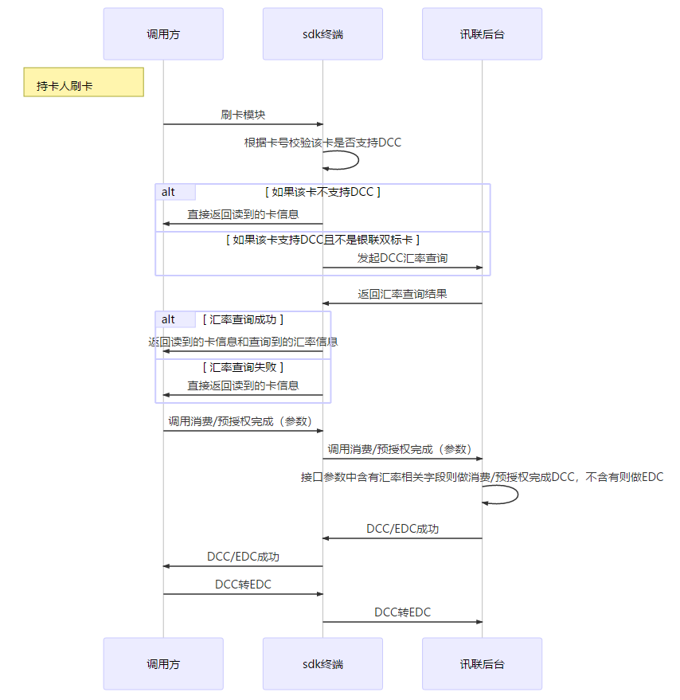

### SDK 关于DCC处理逻辑 
**序列图**  

**流程概述**  

1. 在POS终端中载入最新的VISA/MC/JCB的卡BIN信息
2. 终端获取卡BIN信息并进行判断是否支持DCC，目前支持DCC的卡组织包括：
    *	Visa：卡号4开头；
    *	万事达：卡号51-55开头，以及以222100-272099开头
    *	JCB：卡号35开头
若卡号不属于以上范围，则终端直接向讯联后台发送EDC交易请求，若是，则进行下一步判断
3. 判断是不是银联双标卡（终端需要装载双标卡BIN），若是，则不支持DCC交易，发送银联卡交易请求；若不是，则由讯联进行DCC汇率查询
4. 讯联返回查询结果至终端，终端检查查询结果，若查询失败，向讯联发送EDC交易请求；
5. 若汇率查询成功，POS机收到查询成功应答，POS发起DCC交易请求。
6. 讯联向卡组织申请DCC消费授权，进入正常DCC消费流程，后续处理流程同现有流程，保持不变。即打印DCC签购单，由持卡人选择DCC或EDC；
7. 若持卡人选择DCC，则终端继续打印DCC签购单；若持卡人选择EDC，则终端向讯联发送DCC转EDC请求，同时打印EDC签购单。

> 注意  
做DCC交易时需要在isOpenDCC方法中将消费或者预授权完成的交易返回true。  
调用卡消费和卡预授权完成别忘了将读卡回调返回的汇率信息设置进request。  
对于支持DCC的卡，调用消费或者预授权完成接口，sdk默认做DCC交易，做完后提供DCC转EDC选项供持卡人选择。